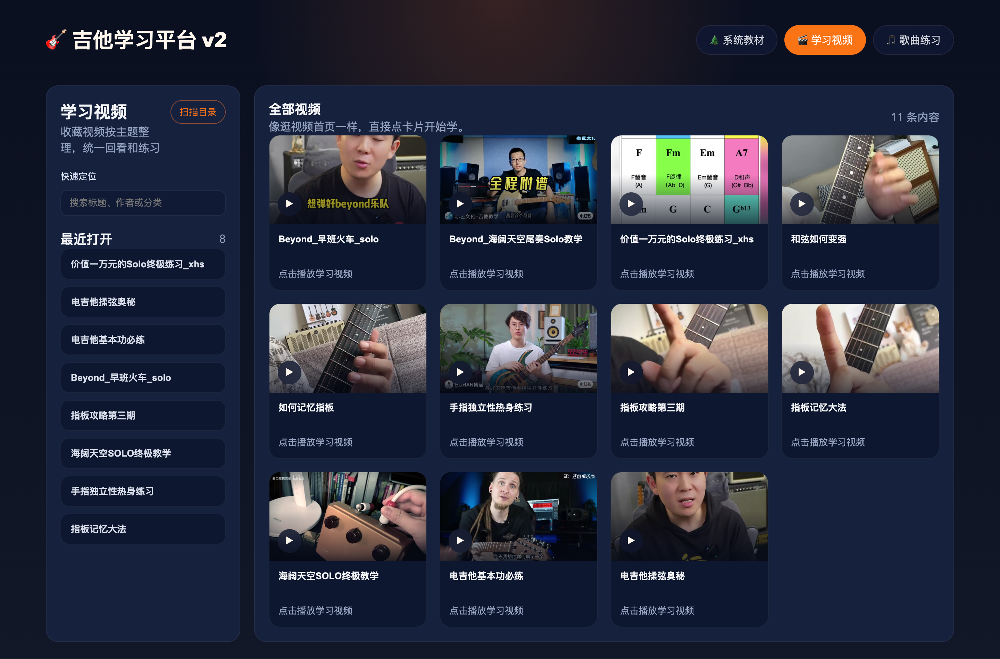
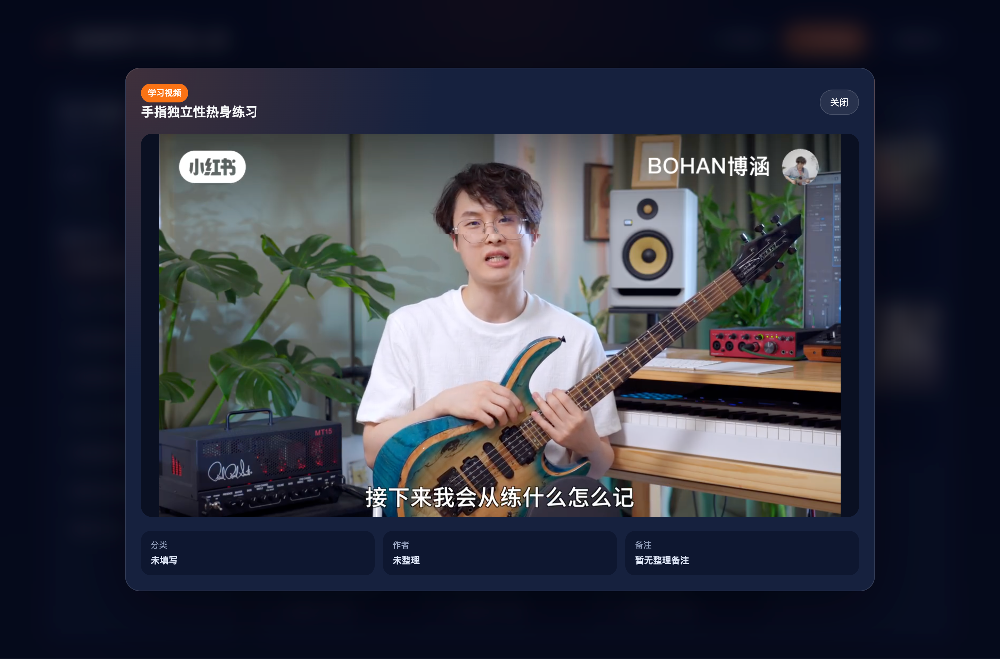
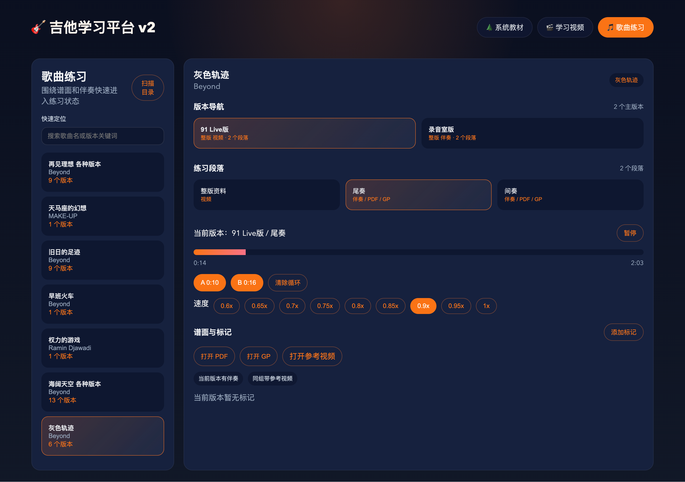
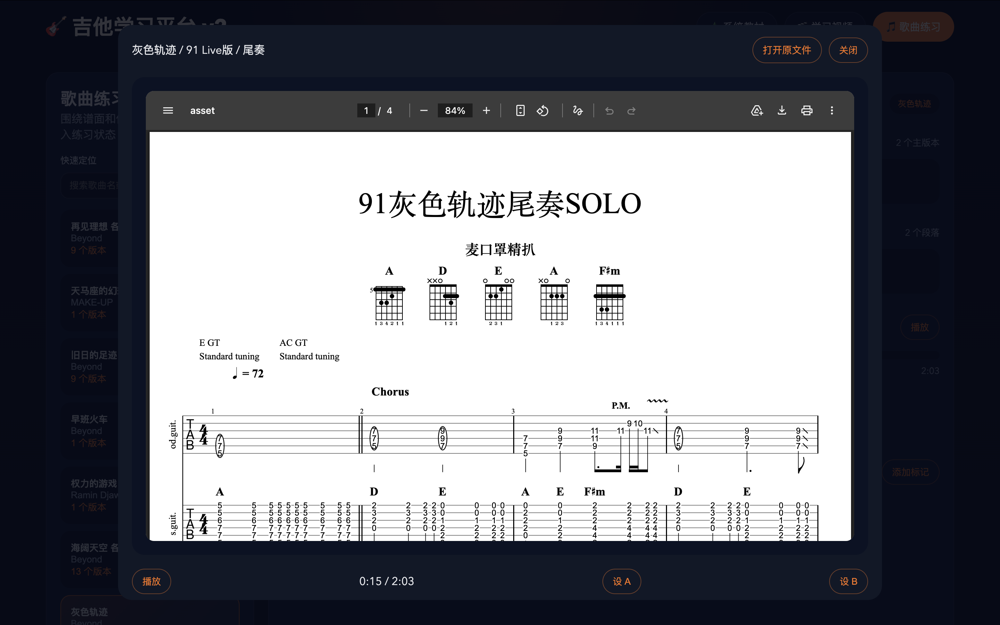

# 吉他学习平台项目介绍

编写日期：2026-04-26  
编写人：Codex

## 一、项目背景

这是一个非常“非典型”的软件项目。

项目的发起者并不是程序员，也没有编程基础，而是一位真实有练琴需求的吉他学习者。因为长期在自学过程中遇到几个很具体的问题：

- 系统教材、零散教学视频、歌曲谱例和伴奏分散在不同地方，管理成本很高
- 想练某一首歌时，经常需要在文件夹、播放器、PDF、GP 谱之间来回切换
- 收藏了很多 B 站、小红书、YouTube 的学习视频，但后续很难沉淀成自己的长期学习资料
- 想把“学习”和“练习”真正整合成一个适合自己日常使用的平台

于是，这个项目的目标并不是做一个面向所有人的“大而全产品”，而是做一个真正服务于个人学习流程的、本地化的、长期可用的吉他学习平台。

更有意思的是，这个平台并不是由一个传统开发团队在数周或数月内完成的，而是由一位编程基础为 0 的吉他练习者，基于自己的实际学习与练琴需求，在 Codex + GPT-4.5 的协作下，用一天半时间完成了第一版正式可用产品。

它既是一个吉他学习平台，也是一次“普通用户直接借助 AI 完成软件构建”的真实案例。

## 二、项目定位

这个平台的核心定位很明确：

**它不是一个公开内容平台，而是一个面向个人学习场景的本地吉他学习工作台。**

它围绕用户最核心的两个高频场景展开：

1. 看视频学习
   包括系统教材视频，以及从 B 站、小红书、YouTube 等来源沉淀下来的学习视频。
2. 跟谱和伴奏练歌
   围绕 PDF、GP 谱、伴奏音频、A/B 打点、变速、段落练习等功能，快速进入练琴状态。

整个产品结构因此被整理成三个最主要的模块：

- 系统教材
- 学习视频
- 歌曲练习

这个划分不是从“内容来源”出发，而是从“用户实际怎么学、怎么练”出发。

## 三、平台整体架构

这是一个本地运行的前后端分离项目，强调“轻量、本地、可控、适合个人长期使用”。

### 1. 前端

前端使用：

- Vue 3
- Vite

前端负责：

- 三大模块页面的交互与展示
- 视频卡片流、课程树、歌曲练习页面
- 弹窗播放器、谱面预览、进度控制、打点与变速操作
- 与后端 API 通信，动态获取本地素材索引

### 2. 后端

后端使用：

- FastAPI

后端负责：

- 扫描本地素材目录
- 生成并维护平台索引
- 提供视频、音频、PDF、GP 等资源访问接口
- 支持 HTTP Range 请求，解决拖动进度、局部加载等问题
- 提供课程问答与练习计划生成接口
- 处理资源删除、索引更新、缩略图清理等管理逻辑

### 3. 本地资源层

平台围绕本地 `library/` 目录工作，主要包括：

- `library/courses/`：系统教材
- `library/collected/`：学习视频
- `library/songs/`：歌曲练习资源

也就是说，这个平台的“内容库”不在云端，而是在用户自己的本地目录里。这让它天然适合个人长期积累，不依赖外部平台是否改版、下架或失效。

### 4. 本地常驻服务

平台后续被升级为本地后台长期运行模式：

- 前端服务常驻在 `127.0.0.1:3000`
- 后端服务常驻在 `127.0.0.1:8000`

用户平时只需要直接访问：

`http://127.0.0.1:3000/`

不必每次重新手动启动开发环境。桌面还配套了启动器和服务控制器，用于唤醒、重启和停止本地服务。

## 四、核心模块说明

### 1. 系统教材模块

系统教材模块服务于“按课程体系学习”的场景。

它支持：

- 多套教材并行管理，而不是只支持单一教材
- 教材切换按钮固定在上方，方便随时切换不同体系
- 树状章节结构展示，学习内容一目了然
- 直接点击具体课时进入学习
- 记录最近学习内容和播放进度
- 随课资料整合展示，包括 PDF、GP、音频等
- 课程问答与练习计划生成功能

这一模块的设计重点是：**让教材回到“像教材”一样的使用方式**，而不是把系统课程也做成杂乱的视频列表。

### 2. 学习视频模块

学习视频模块服务于“碎片化但高频”的视频学习场景。

它支持：

- 自动扫描本地收藏的视频目录
- 使用更接近 B 站首页的视频卡片流形式展示内容
- 以真实视频首帧生成封面，而不是纯占位图
- 弹窗播放，不打断页面浏览节奏
- 竖屏视频自适应，不会溢出屏幕
- 搜索、最近打开记录、目录扫描更新
- 平台内直接删除视频，并同步清理缩略图

这一模块的一个重要设计原则是：

**不按视频来源分类，不强调“这是 B 站的、那是小红书的”，而是统一作为“学习视频”来管理。**

因为对用户来说，真正重要的是“这个视频能不能帮我学会某个内容”，而不是它最初来自哪个平台。

### 3. 歌曲练习模块

歌曲练习模块是整个平台最偏“练琴工作台”的部分。

它支持：

- 歌曲列表浏览与搜索
- 多版本管理
- PDF 曲谱打开与预览
- GP 谱打开与兼容处理
- 音频伴奏播放
- 播放进度拖动
- A/B 打点循环练习
- `0.60x - 1.00x` 变速练习
- 标记功能
- 谱子弹窗底部播放器，支持更紧凑的专业练习控制

这个模块的目标不是“展示歌曲信息”，而是**尽可能快地把用户送进练琴状态**。

也就是说，当用户打开一首歌时，不应该再去不同软件之间来回切换，而是能够直接在一个界面中完成：

- 看谱
- 听伴奏
- 拖进度
- 设循环
- 降速练习

### 4. 小霞问答模块

在系统教材场景里，平台还集成了“小霞问答”。

它基于课程 transcript 和 AI 能力，为用户提供：

- 当前课程重点提炼
- 知识点解释
- 难点答疑
- 针对当前课程生成练习任务

这一功能接入的是 MiniMax 国内 Token Plan 的兼容接口，并做了本地 `.env` 配置与密钥保护，保证真实密钥不会进入 Git 仓库。

## 五、项目的一个重要创新点

这个项目有一个非常值得单独说明的创新点：

**用户不需要自己手动整理视频索引文件。**

在实际使用中，用户只需要把 B 站、小红书、YouTube 的视频链接发给 `openclaw` 的 agent，agent 会负责完成后续动作：

1. 下载视频
2. 将视频存入平台约定的本地 `library` 目录
3. 平台扫描本地目录
4. 学习视频模块自动把新内容纳入系统

这意味着用户面对的不是传统意义上的“内容管理后台”，而是一种更自然的 AI 协作方式：

- 用户表达需求
- Agent 处理素材获取和落库
- 平台自动完成扫描与接入

从产品角度看，这相当于把“内容导入”从一个繁琐的后台操作，变成了一种接近自然语言的工作流。

对于个人学习平台来说，这个体验非常关键，因为它大幅降低了持续维护学习资料的门槛。

## 六、开发过程与协作方式

这个项目最特别的地方，不只是功能本身，而是它的开发方式。

整个项目并不是先有完整 PRD、再有设计稿、再进入传统迭代，而是一个高度贴近真实需求的快速协作过程：

- 用户一边使用，一边提出更细的学习与练琴需求
- AI 负责理解需求、分析已有代码、修改前后端、运行构建和测试
- 产品形态在不断试用、反馈、修正中快速成型

在这个过程中，需求并不是“被假设出来的”，而是从真实使用中被逐渐打磨清楚的。例如：

- 学习视频不需要按来源分类
- 系统教材更适合树状列表，而不是普通流式卡片
- 教材切换要固定在上方，而不是放在页面深处
- 歌曲练习页面的重点不只是打开谱，而是围绕练习动作设计控制方式
- 谱子弹窗下方的播放器要更紧凑、更专业，更像一个真实练习工具

这种开发方式非常像“产品和工程实时耦合在一起”的现场共创。

而 AI 在这里扮演的角色，并不是简单生成几段代码，而是：

- 理解需求
- 分析已有实现
- 修改前后端
- 跑构建和测试
- 调整交互结构
- 补充本地脚本和文档
- 将真实使用反馈快速落地

## 七、为什么这个项目有意义

这个项目的意义，不只是“做了一个吉他学习平台”。

它更像是在说明一件事：

**当用户对自己的问题足够清楚时，即使没有编程基础，也可以借助 AI 在极短时间内完成过去需要开发团队才能完成的软件工作。**

这个案例有几个很典型的价值：

- 它来自真实需求，而不是概念演示
- 它是实际可运行、可长期使用的本地产品
- 它展示了 AI 如何降低个人软件构建门槛
- 它也展示了“普通用户 + AI”可以形成一种新的产品开发方式

过去，一个吉他学习者可能只能适应通用软件；现在，他可以开始构建真正适合自己的工具。

## 八、当前版本状态

当前版本已经进入正式可用阶段。

版本号：

**v1.1.0**

这一版本已经基本打通：

- 系统教材学习
- 学习视频沉淀与播放
- 歌曲谱面与伴奏练习
- 本地服务常驻
- 平台内资源删除
- AI 问答与练习辅助
- 文档、脚本与本地运行机制

它不是一个“演示版想法”，而是一个已经可以每天打开使用的个人学习平台。

## 九、总结

这是一个由真实用户需求推动、由 AI 深度参与完成的本地吉他学习平台。

它用很短的时间，把一个原本分散、低效、需要频繁切换工具的学习过程，整合成了一个统一、连续、可积累的工作台。

更重要的是，它证明了一件以前很难想象的事：

**一个编程基础为 0 的用户，也可以基于自己的需求，在 Codex + GPT-4.5 的帮助下，用一天半时间做出真正可用的软件产品。**
